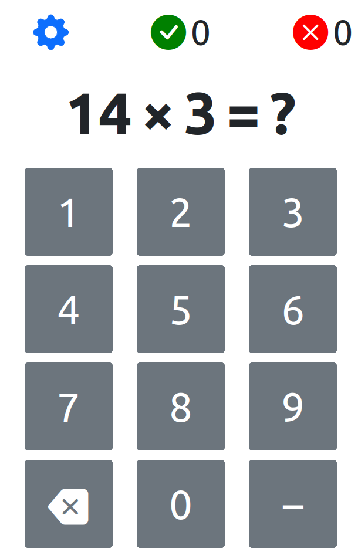

# Arigame

An arithmetics game written for my sisters.

## Play [here](https://deemp.github.io/arigame/)

<div align="center"></div>

## Development

1. Get development tools.

    - [nodejs](https://nodejs.org/en), [purescript and spago](https://www.purescript.org/).
    - Alternatively:

        1. [Install Nix](https://github.com/deemp/flakes/blob/main/README/InstallNix.md) and `direnv`.
        1. Enable `direnv` in this directory.

            ```console
            direnv allow
            ```

        1. Now, you should have a `devShell` with tools like `nodejs`, `purescript`, `dhall-lsp-server`, etc.
        1. If using `VSCode`, install the `nwolverson.ide-purescript` extension.

1. Install dependencies.

    ```console
    npm i
    ```

1. Run `SASS` converter in watch mode.

    ```console
    npm run sass
    ```

1. Run `spago` in watch mode.

    ```console
    spago build -w
    ```

    - The `nwolverson.ide-purescript` extension for `VSCode` does this for you.

1. Run `parcel` in watch mode.

    ```console
    npm run dev
    ```

   - It will open a browser tab with the app running on port `1234`.

1. (Optionally) Run `localtunnel` to access your app on other devices.

    ```console
    npx lt -p 1234 -s <SUBDOMAIN>
    ```

   - It will listen on port `1234`.
   - The app will be available at `https://<SUBDOMAIN>.loca.lt`.
   - You can specify subdomain via the `-s` argument.

## References

- [Well-typed printfs cannot go wrong](https://blog.csongor.co.uk/purescript-safe-printf/)
- [purescript-barlow-lens](https://github.com/sigma-andex/purescript-barlow-lens)
- [Instance Chains](https://github.com/purescript/documentation/blob/master/language/Type-Classes.md)
